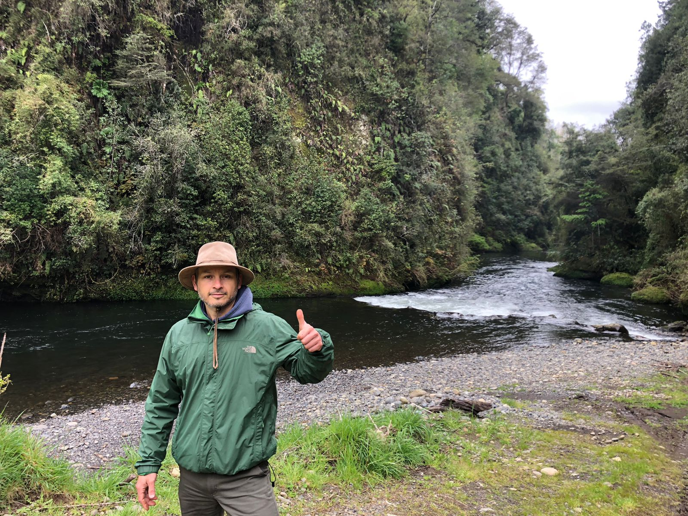
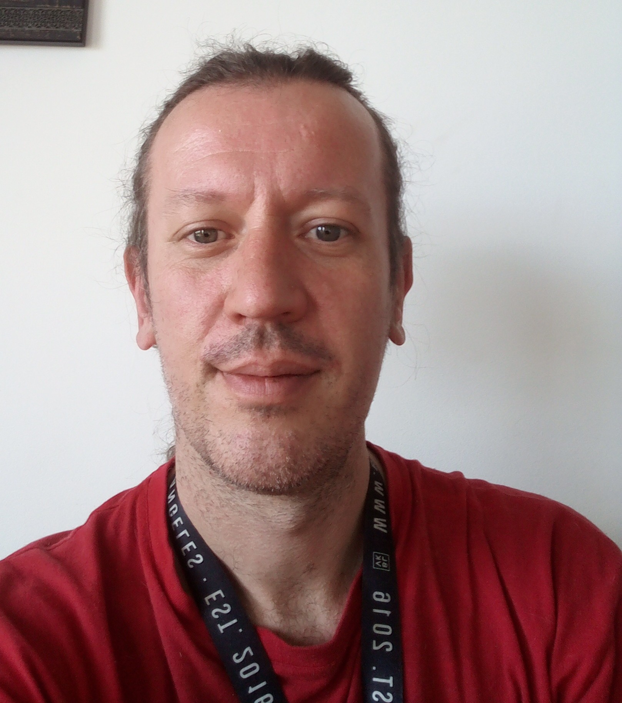
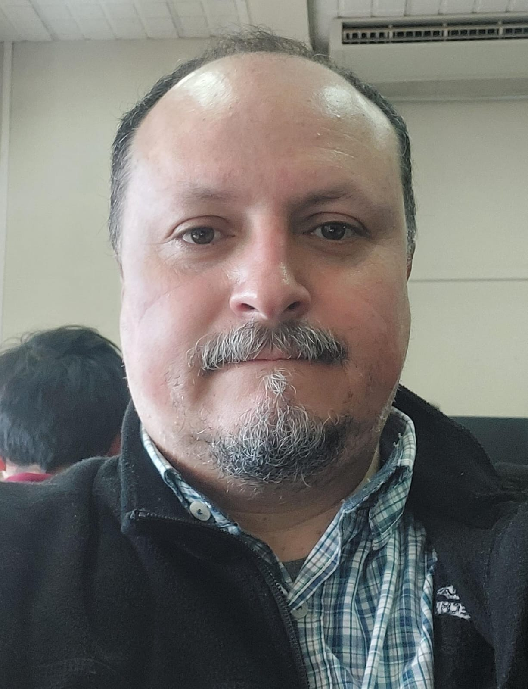

# Ricardo Segovia

{width=50%}

Ricardo Segovia, coordinador del equipo BioData del Instituto de Ecología y Biodiversidad. Con experiencia en biogeografía y ecología ahora estoy enfocado en la creación y gestión de bases de datos de biodiversidad.

# Marius Bottin

{width=50%}

Marius Bottin. Soy un ecólogo francés viviendo en Bogotá, Colombia. He trabajado en la ecología de la diatomeas de los ríos franceses, las vegetaciones de las praderas secas del sur-occidente de Francia y los páramos colombianos. Ahora me dedico principalmente a... ¡limpiar datos de biodiversidad! (una otra manera más seria de decir lo mismo es: trabajo en la estructuración y el mantenimiento de bases de datos de biodiversidad).

# Diego Alarcón

{width=50%}

