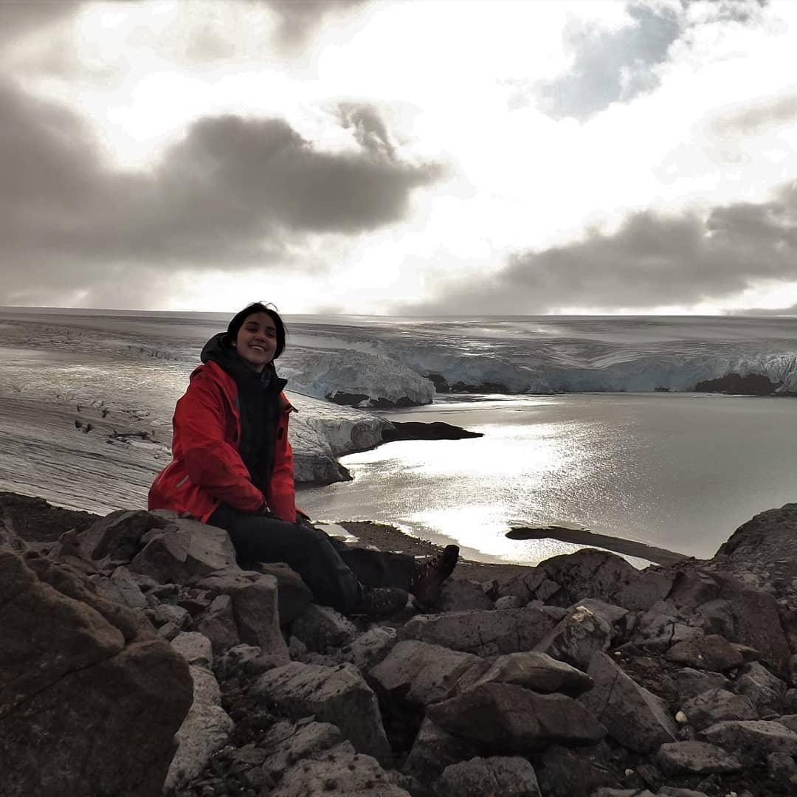
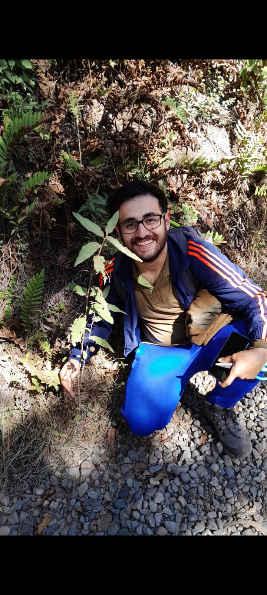

```{r echo=F}
require(knitr)


include_graphics('./Fotos/fotosGrupo/IMGP8125.jpg')


```


# Ricardo Segovia

{width=50%}

Ricardo Segovia, coordinador del equipo BioData del Instituto de Ecología y Biodiversidad. Con experiencia en biogeografía y ecología ahora estoy enfocado en la creación y gestión de bases de datos de biodiversidad.


# Marius Bottin

{width=50%}

Soy un ecólogo francés viviendo en Bogotá, Colombia. He trabajado en la ecología de la diatomeas de los ríos franceses, las vegetaciones de las praderas secas del sur-occidente de Francia y los páramos colombianos. Ahora me dedico principalmente a... ¡limpiar datos de biodiversidad! (una otra manera más seria de decir lo mismo es: trabajo en la estructuración y el mantenimiento de bases de datos de biodiversidad).


# Diego Alarcón

{width=50%}

# Catalina Merino

{width=50%}

Mi nombre es Catalina Merino Yunnissi, soy Bióloga con estudios de postítulo en GIS y Métodos Estadísticos. Cuando egresé entré a trabajar en el Museo Nacional de Historia Natural, al Área de Zoología de Invertebrados. Actualmente soy la Administradora de Colecciones del Área y me encargo de la gestión, conservación y documentación de estas.


# Felipe Durán

{width=50%}

Soy biólogo y actualmente estudiante del Doctorado en Sistemática y Biodiversidad de la Universidad de Concepción, donde me encuentro desarrollando mi proyecto de tesis relacionada a la evolución de los ciclos de vida, utilizando como modelo de estudio a los anfibios. Anteriormente me he dedicado a estudiar la biodiversidad de anuros chilenos desde una perspectiva taxonómica, filogeográfica y ecológica.


# Gustavo Torres Mellado

{width=50%}

Gustavo A. Torres Mellado, biólogo con mención en biodiversidad y conservación biológica UdeC. Desde hace más de una década me dedico a la consultoría ambiental, específicamente a la caracterización desde matrices bióticas diversas, principalmente flora y vegetación, y en menor grado funga, fauna terrestre, limnología, entre otros. Durante mis años formativos me he dedicado a la ecología de microorganismos del suelo, específicamente en la simbiosis micorrícica de ambientes extremos.

# Pamela Martínez
{width=50%}

Me llamo Pamela Martínez, soy Ingeniera Forestal de la Pontificia Universidad Católica de Chile. Me titulé con la especialidad de territorio y manejo de bosque. He trabajado construyendo una geodatabase de datos históricos vegetacionales, y he ayudado a crear indicadores para determinar lugares prioritarios de reforestación a nivel nacional. Además, me he desenvuelto en otras áreas, con temáticas relacionadas con mi profesión y otras que no son abarcadas dentro de esta. Actualmente me desempeño como asistente de gerencia en IEB.


# Javiera Vergara Vidal

Soy de Concepción, Soy licenciada en biología de la Universidad de Concepción. 
terminé un trainee en fullstack orientado a python (django), por lo que se supone soy programadora *junior* (pero creo que aun me falta mucho para considerarme junior)
Estoy en un diplomado de data analyst pero me está costando mucho power Bi
Estoy Seleccionada para un programa de talento digital para Chile en data science para el próximo año.
Mi portafolio incompleto:
https://portfolio-darkss.vercel.app/

Mi github está incompleto y desordenado
 https://github.com/xavi-v

Mi linkedin está incompleto y desordenado tambien https://www.linkedin.com/in/javi-vergara-vidal/

mini tutorial que hice para postgres en Windows
https://miro.com/app/board/uXjVNOqt4Cw=/

Pasé por paleontología, micología,tengo licencia de buceo autónomo básico pero aun no tengo licencia tipo B.

# Angelica Villalobo Lopez


Soy biólogo, MSc mención Botánica, actualmente estudiante de Doctorado en Sistemática y Biodiversidad en la Universidad de Concepción. Mi investigación se enfoca en la conservación, centrándome principalmente en las especies del género Copiapoa que habitan por toda la costa de Chile, he trabajado actualizando gran parte de las áreas de ocupaciones y extensiones de presencia de estas especies y en los estados de conservación.


# Amparo Rodriguez

{width=50%}
Soy Amparo M Rodríguez Ruiz, graduada en biología por la Universidad de Sevilla y diplomada en Ornitología. Mi interés se centra en la biología de vertebrados depredadores y su conservación, principalmente buscando la resolución de conflictos humano-animal. Actualmente profundizo en el estudio de la conducta y ecología de aves rapaces a través del doctorado en Sistemática y Biodiversidad de la Universidad de Concepción.

# Karla García


{width=50%}

Soy Bióloga con Mención en Biodiversidad y Conservación Biológica, Magíster en Zoología y Doctora en Biodiversidad. Mis líneas de interés e investigación han estado relacionadas a la conservación y ecología de poblaciones de mamíferos. Parte importante de mi trayectoria profesional también ha estado relacionada con la consultoría y gestión ambiental, enfocándome en realizar levantamientos biológicos, coordinación de equipos y formando parte de estudios de planificación territorial de áreas silvestres. 

# Catalina Marin Cruz 

{width=50%}

Soy Catalina Marín Cruz, Bióloga y Magister en Ciencias con mención en Botánica. Mis estudios científicos se han centrado en líquenes de ambientes extremos, principalmente aquellos que habitan en el Desierto de Atacama y la Antártica. Estudiando las condiciones microclimáticas en los lugares donde estos organismos habitan, comparado la respuesta de fotosintética primaria ante la desecación y shock térmico con especies del desierto y la Antártica, además el efecto del calentamiento pasivo en especies antárticas. Actualmente soy Data Manager del Instituto Milenio Bases de Ecosistemas Antárticos y Subantárticos (BASE), donde me encargo del manejo de datos de todas las líneas de investigación, asegurando la publicación de dicha información bajo los principios FAIR.


# Francisca González Contreras


{width=50%}

Encargada de Sistemas de Información Geográfica de proyecto Fauna Impactada.
Candidata a Magíster en Análisis Geográfico de Universidad de Concepción.Licenciada en Geografía Universidad de Chile


# fran gonzalez deramond

{width=50%}

Hola!... Soy bióloga marina y me apasiona mucho las macroalgas, en especial las pardas. Mi pasatiempo favorito es ir a bucear junto con mis amigxs a la Reserva Marina Isla de Chañaral, ubicada en la región de Atacama. ¡Lo recomiendo enormemente! Este lugar es simplemente increíble, repleto de biodiversidad marina. En la actualidad, me desempeño como especialista en biodiversidad, trabajando en proyectos de impacto ambiental. Mi enfoque principal es la conservación de especies y la mitigación de los impactos en los ecosistemas. 


# Juan Pablo Vicencio

{width=50%}

Me llamo Juan Pablo Vicencio Segura, provengo de la ciudad de San Felipe (Región de Valparaíso) y actualmente me encuentro cursando cuarto año de Ingeniería en Conservación de Recursos Naturales en la Universidad Austral de Chile (Valdivia).  Mi interés profesional aboga a la botánica, y en ese sentido he estado trabajado en el levantamiento del herbario VALD y la puesta en valor de su pequeña colección botánica. 

# Valentina Perez

{width=50%}
Soy Valentina Pérez, Ingeniera forestal de profesión. Mis temas de interés son principalmente la botánica, la biogeografía y ecología evolutiva por lo que me gustan mucho las plantas. He trabajado con manejo de base de datos principalmente con rasgos funcionales de plantas leñosas de Chile. Me gusta andar en bicicleta, hacer cerámica y cocinar.


# Victoria_Arevalo
{width=50%}


Soy Ingeniera Forestal de la Universidad de Chile. Me he desempeñado como Especialista de Flora y Vegetación en el área de consultoría ambiental. Actualmente me desempeño como Profesional de Ecosistemas Terrestres en el Ministerio del Medio Ambiente, para el programa de Desarrollo Productivo Sostenible que tiene por objetivo el proyecto de construir una Línea de Base Pública (LBP). Principalmente trabajo con gestión de políticas públicas, bases de datos de biodiversidad a través del estándar DarwinCore, que provienen de distintas fuentes de información, como de colecciones biológicas, datos primarios tomados en terreno o archivos de texto (PDF/WORD). Además, ayudo en la transferencia de capacidades técnicas para nuevos publicadores de datos de biodiversidad a través de la red de GBIF.